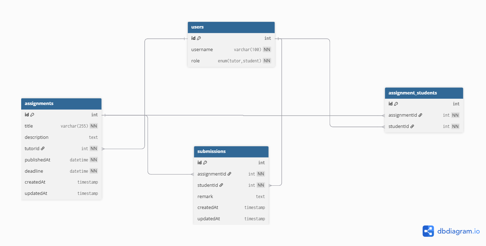

# 🏫 Virtual Classroom Backend (MySQL + Node.js)

## 📘 Overview
This is a **stateless microservice backend** for a **Virtual Classroom** app built with **Node.js**, **Express**, and **MySQL** using **Sequelize ORM**.

It provides APIs for:
- JWT-based Authentication
- Tutor & Student roles
- Assignment management (Tutor)
- Submission system (Student)
- Filtered Assignment Feed
- Includes SQL schema, ER diagram, and Postman collection

---

## ⚙️ Tech Stack

| Component | Technology |
|------------|-------------|
| Runtime | Node.js |
| Framework | Express |
| Database | MySQL |
| ORM | Sequelize |
| Auth | JWT (jsonwebtoken) |
| Utilities | dotenv, body-parser, cors, nodemon |
| Docs | Postman Collection |
| ER Diagram | ER_Diagram.png |

---

## 🧩 Folder Structure

```
virtual-classroom/
├── server.js
├── package.json
├── .env
├── config/
│   └── db.js
├── middleware/
│   └── auth.js
├── routes/
│   ├── auth.js
│   ├── assignments.js
│   └── submissions.js
├── models/
│   ├── User.js
│   ├── Assignment.js
│   ├── AssignmentStudent.js
│   └── Submission.js
├── sql/
│   └── schema.sql
├── ER_Diagram.png
├── Virtual_Classroom.postman_collection.json
└── README.md
```

---

## 🛠️ Setup Instructions

### 1️⃣ Install MySQL
Create a database and user:
```sql
CREATE DATABASE virtual_classroom;
CREATE USER 'vc_user'@'%' IDENTIFIED BY 'vc_password';
GRANT ALL PRIVILEGES ON virtual_classroom.* TO 'vc_user'@'%';
FLUSH PRIVILEGES;
```

Or run MySQL in Docker:
```bash
docker run --name vc-mysql -e MYSQL_ROOT_PASSWORD=rootpwd -e MYSQL_DATABASE=virtual_classroom -p 3306:3306 -d mysql:8
```

### 2️⃣ Configure Environment
Edit `.env` file:
```
JWT_SECRET=your_secret
DB_HOST=localhost
DB_PORT=3306
DB_NAME=virtual_classroom
DB_USER=vc_user
DB_PASS=vc_password
PORT=4000
```

### 3️⃣ Install & Run
```bash
npm install
npm start
```
Server starts at: `http://localhost:4000`

---

## 🔑 Authentication Flow

1. `POST /auth/login`
   ```json
   {
     "username": "alice",
     "password": "any",
     "role": "tutor"
   }
   ```
   Response:
   ```json
   {
     "token": "<JWT_TOKEN>",
     "user": { "id": 1, "username": "alice", "role": "tutor" }
   }
   ```

Use token in header:
```
Authorization: Bearer <JWT_TOKEN>
```

---

## 🧱 API Endpoints

### Authentication
| Method | Endpoint | Description |
|---------|-----------|-------------|
| POST | `/auth/login` | Mock login, returns JWT |

### Assignments (Tutor)
| Method | Endpoint | Description |
|---------|-----------|-------------|
| POST | `/assignments` | Create assignment |
| PUT | `/assignments/:id` | Update assignment |
| DELETE | `/assignments/:id` | Delete assignment |
| GET | `/assignments/:id` | Get details (shows all submissions if tutor) |
| GET | `/assignments/feed` | Tutor feed with filters |

### Submissions (Student)
| Method | Endpoint | Description |
|---------|-----------|-------------|
| POST | `/assignments/:id/submit` | Submit assignment |
| GET | `/assignments/:id` | Get student submission |
| GET | `/assignments/feed` | Student feed (filters: publishedAt, status) |

---

## 🗃️ Database Schema (MySQL)

See `sql/schema.sql` or this summary:

**Users**
- id (PK)
- username
- role (tutor/student)

**Assignments**
- id (PK)
- title
- description
- tutorId (FK → users.id)
- publishedAt
- deadline

**Assignment_Students**
- assignmentId (FK → assignments.id)
- studentId (FK → users.id)

**Submissions**
- assignmentId (FK → assignments.id)
- studentId (FK → users.id)
- remark

---

## 📊 ER Diagram


---

## 📬 Postman Collection

Import the file: `Virtual_Classroom.postman_collection.json`  
It contains ready-to-run API requests for:
- Login (Tutor/Student)
- Create Assignment
- Submit Assignment
- Fetch Details
- Feed

Use `{{tutorToken}}` and `{{studentToken}}` variables in Postman.

---

## 👨‍💻 Author
**Aditya Singh**  

---
